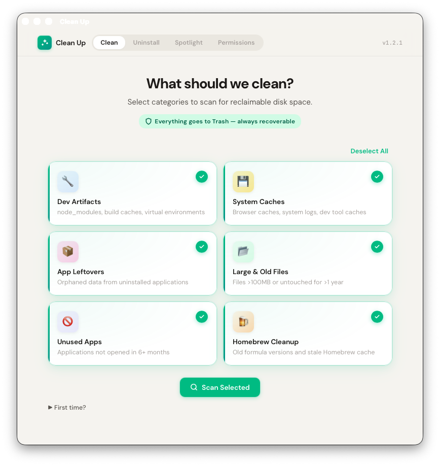

# Clean Up

Interactive macOS cleanup tool — a native Tauri v2 desktop app. Finds junk files, unused apps, stale caches, and dev artifacts — lets you review everything before moving selected items to Trash.

Zero runtime dependencies. One standalone binary. Everything is recoverable.

<p align="center">
  
</p>

## Download

Grab the latest `.dmg` from the [Releases page](https://github.com/NOGIT007/clean-up/releases).

**Install steps (unsigned app):**

1. Open the DMG and drag **Clean Up** to Applications
2. On first launch macOS will block it — go to **System Settings → Privacy & Security**
3. Click **"Open Anyway"** next to the Clean Up warning
4. For full scanner coverage, grant **Full Disk Access** (System Settings → Privacy & Security → Full Disk Access)

Requires **macOS 13.0+** (Ventura or later) on Apple Silicon or Intel.

## Features

- **6 scanners** — dev artifacts, system caches, app leftovers, large/old files, unused apps, Homebrew cleanup
- **Native app** — Tauri v2 webview with a polished single-page UI
- **App uninstaller** — lists installed apps with icons, finds all associated data (caches, preferences, containers), and removes everything in one click
- **Spotlight maintenance** — check indexing status and trigger reindex from the UI
- **Permissions checker** — see which macOS permissions are granted and open settings directly

## What It Scans

| Scanner               | What it finds                                                                                         | Details                                              |
| --------------------- | ----------------------------------------------------------------------------------------------------- | ---------------------------------------------------- |
| **Dev Artifacts**     | `node_modules`, `.next`, `dist`, `.venv`, `target`, build caches                                      | Walks home dir (5 levels deep), min 1 MB             |
| **System Caches**     | Browser caches (Chrome, Firefox, Safari, Arc, etc.), Xcode DerivedData, Homebrew, pip, yarn, npm, Bun | Min 5 MB, flags TCC-protected paths                  |
| **App Leftovers**     | Orphaned preferences, caches, containers from uninstalled apps                                        | Scans ~/Library subdirectories, matches by bundle ID |
| **Large & Old Files** | Files >100 MB or untouched for >1 year                                                                | Smart git detection — won't flag active repo files   |
| **Unused Apps**       | Apps not opened in 6+ months                                                                          | Uses Spotlight metadata, excludes 50+ system apps    |
| **Homebrew**          | Old formula versions, stale downloads                                                                 | Uses `brew cleanup --dry-run`                        |

## Install

See **[INSTALL.md](INSTALL.md)** for full step-by-step instructions (prerequisites, build, permissions, troubleshooting).

**Quick start** (requires [Rust](https://rustup.rs), [Tauri CLI](https://tauri.app), and [Bun](https://bun.sh)):

```bash
git clone https://github.com/NOGIT007/clean-up.git
cd clean-up
bun run build:app
bun run install:app
```

Then search for **"Clean Up"** in Spotlight.

## How It Works

1. **Select** — pick which scanners to run (or select all)
2. **Scan** — the tool walks relevant directories and calculates sizes
3. **Review** — browse findings grouped by category, see size and age for each item
4. **Trash** — selected items move to macOS Trash (always recoverable via Finder)

Nothing is permanently deleted. Every action requires your explicit confirmation.

## Tabs

- **Clean** — run scanners, review results, select and trash items
- **Uninstall** — browse installed apps with icons, see associated data across ~/Library, remove apps and all their data
- **Spotlight** — check Spotlight indexing status and trigger a reindex
- **Permissions** — check macOS permissions (Full Disk Access, Automation, App Management)

## Security

- **Zero dependencies** — no npm packages at runtime, single compiled Rust binary
- **Never calls `rm`** — everything goes through macOS Trash (recoverable)
- **Path blocklist** — critical system paths (`/System`, `/Library`, `/usr`, etc.) are hardcoded as off-limits
- **No network access** — fully offline, no telemetry, no updates
- **You review everything** — nothing is trashed without explicit selection and confirmation

## Uninstall

```bash
rm -rf ~/Applications/Clean\ Up.app
rm -f ~/.local/bin/clean-up
```

No other files are created outside the app bundle.

## First Launch

- **Gatekeeper**: The app isn't notarized. Right-click → **Open** → click **Open** to bypass the warning once.
- **Full Disk Access**: Some scanners need Full Disk Access. Go to System Settings → Privacy & Security → Full Disk Access and add Clean Up.app. This must be re-granted after each rebuild.

## Requirements

- macOS 13.0+ (Ventura or later)
- Apple Silicon or Intel Mac

## License

[MIT](LICENSE)
